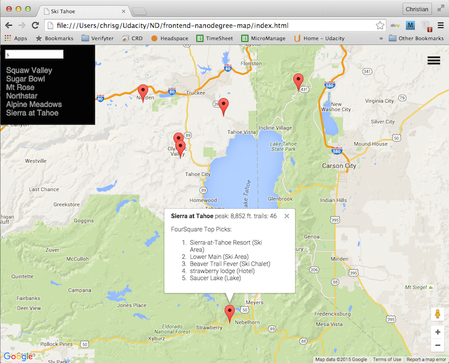

# Udacity Frontend Nanodegree Map Project 5.1
---
### How to Start

Clone this repository onto your machine:

```
    $> git clone https://github.com/cg94301/frontend-nanodegree-map.git
    $> cd frontend-nanodegree-map
```

Open index.html in your browser. You should see a map of Lake Tahoe with markers marking ski resorts in the area. 

### Information on Markers
Click on any marker to bring up information on that location. The information shows peak elevation, number of runs and associated Foursquare top picks.

### Filter Markers
There is a hamburger icon in the right upper corner. Click on the hamburger icon to bring up a list of the ski resorts with input for a filter term. The filter allows to filter resorts by name.  You can also click on any resort in the resorts list to bring up the information associated with that resort's marker.

### Ski Tahoe Map

